# 01 — Basic Logic Gates in Verilog

> **VLSI Design Portfolio · Step 1 of 8**
> Verilog HDL implementation of all fundamental logic gates from scratch — with individual testbenches, GTKWave simulation waveforms, and truth table verification for every gate.

---

## Table of Contents
- [Overview](#overview)
- [Repository Structure](#repository-structure)
- [Gates Implemented](#gates-implemented)
- [Block Diagram](#block-diagram)
- [Truth Tables](#truth-tables)
- [Simulation Instructions](#simulation-instructions)
- [Waveforms](#waveforms)
- [Concepts Covered](#concepts-covered)
- [Tools Used](#tools-used)
- [What's Next](#whats-next)

---

## Overview

This is the **first repository** in my journey of building a **16-bit pipelined RISC processor from scratch** using Verilog HDL.

Every component of a digital system — from a simple adder to a full processor — reduces to basic logic gates at the transistor level. This repository implements all 7 fundamental gates individually, each with its own dedicated Verilog module, testbench, and verified simulation waveform.

Each gate is implemented using **continuous assignment (`assign`)** — the standard approach for combinational logic in RTL design — and verified against its complete truth table.

---

## Repository Structure

```
01-basic-logic-gates/
│
├── src/                        # Verilog HDL source files
│   ├── and_gate.v              # 2-input AND gate
│   ├── or_gate.v               # 2-input OR gate
│   ├── not_gate.v              # Single-input NOT gate (inverter)
│   ├── nand_gate.v             # 2-input NAND gate
│   ├── nor_gate.v              # 2-input NOR gate
│   ├── xor_gate.v              # 2-input XOR gate
│   └── xnor_gate.v             # 2-input XNOR gate
│
├── tb/                         # Testbench files
│   ├── and_gate_tb.v           # AND gate testbench
│   ├── or_gate_tb.v            # OR gate testbench
│   ├── not_gate_tb.v           # NOT gate testbench
│   ├── nand_gate_tb.v          # NAND gate testbench
│   ├── nor_gate_tb.v           # NOR gate testbench
│   ├── xor_gate_tb.v           # XOR gate testbench
│   └── xnor_gate_tb.v          # XNOR gate testbench
│
├── sim/                        # Simulation waveforms and outputs
│   ├── and_gate_waveform.png   # GTKWave screenshot
│   ├── and_gate_terminal.png   # Terminal output screenshot
│   ├── or_gate_waveform.png    # GTKWave screenshot
│   ├── or_gate_terminal.png    # Terminal output screenshot
│   ├── not_gate_waveform.png   # GTKWave screenshot
│   ├── not_gate_terminal.png   # Terminal output screenshot
│   ├── nand_gate_waveform.png  # GTKWave screenshot
│   ├── nand_gate_terminal.png  # Terminal output screenshot
│   ├── nor_gate_waveform.png   # GTKWave screenshot
│   ├── nor_gate_terminal.png   # Terminal output screenshot
│   ├── xor_gate_waveform.png   # GTKWave screenshot
│   ├── xor_gate_terminal.png   # Terminal output screenshot
│   ├── xnor_gate_waveform.png  # GTKWave screenshot
│   └── xnor_gate_terminal.png  # Terminal output screenshot
│
├── docs/                       # Documentation and diagrams
│   └── gate_symbols.png        # Circuit symbols and truth table reference
│
└── README.md
```

---

## Gates Implemented

| # | Gate | Symbol | Boolean Expression | Gate Type  |
|---|------|--------|--------------------|------------|
| 1 | AND  | &      | Y = A · B          | Basic      |
| 2 | OR   | \|     | Y = A + B          | Basic      |
| 3 | NOT  | ~      | Y = Ā              | Basic      |
| 4 | NAND | ~&     | Y = ̄(A · B)        | Universal  |
| 5 | NOR  | ~\|    | Y = ̄(A + B)        | Universal  |
| 6 | XOR  | ^      | Y = A ⊕ B          | Arithmetic |
| 7 | XNOR | ~^     | Y = ̄(A ⊕ B)        | Arithmetic |

> **Note:** NAND and NOR are called **Universal Gates** because any Boolean function can be implemented using only NAND gates or only NOR gates. XOR is the foundation of binary addition — it directly computes the **sum bit** in a half adder.

---

## Block Diagram

The diagram below shows all 7 gate circuit symbols with their Boolean expressions, Verilog `assign` statements, and a combined truth table summary.

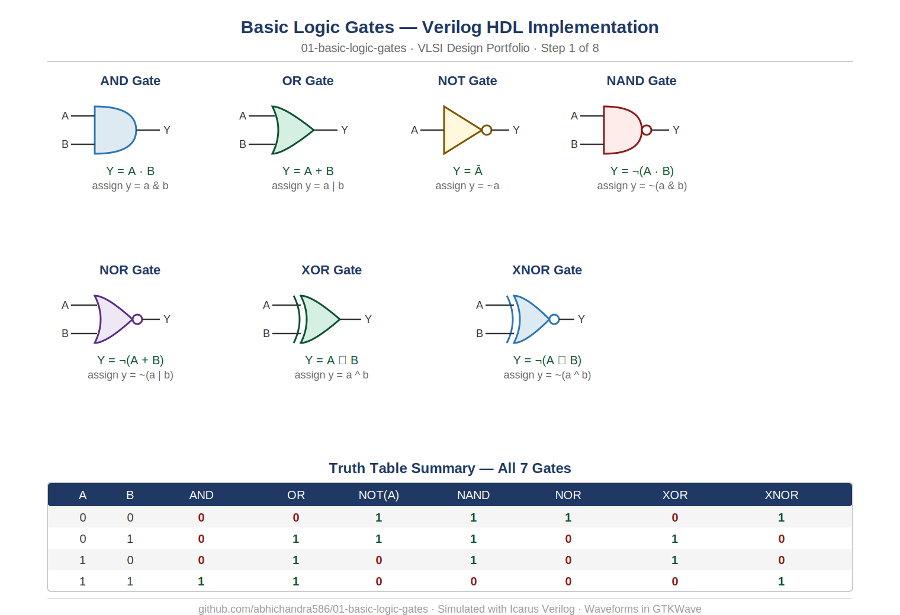

---

## Truth Tables

### AND Gate — Y = A · B
| A | B | Y |
|---|---|---|
| 0 | 0 | 0 |
| 0 | 1 | 0 |
| 1 | 0 | 0 |
| 1 | 1 | 1 |

### OR Gate — Y = A + B
| A | B | Y |
|---|---|---|
| 0 | 0 | 0 |
| 0 | 1 | 1 |
| 1 | 0 | 1 |
| 1 | 1 | 1 |

### NOT Gate — Y = Ā
| A | Y |
|---|---|
| 0 | 1 |
| 1 | 0 |

### NAND Gate — Y = ̄(A · B)
| A | B | Y |
|---|---|---|
| 0 | 0 | 1 |
| 0 | 1 | 1 |
| 1 | 0 | 1 |
| 1 | 1 | 0 |

### NOR Gate — Y = ̄(A + B)
| A | B | Y |
|---|---|---|
| 0 | 0 | 1 |
| 0 | 1 | 0 |
| 1 | 0 | 0 |
| 1 | 1 | 0 |

### XOR Gate — Y = A ⊕ B
| A | B | Y |
|---|---|---|
| 0 | 0 | 0 |
| 0 | 1 | 1 |
| 1 | 0 | 1 |
| 1 | 1 | 0 |

### XNOR Gate — Y = ̄(A ⊕ B)
| A | B | Y |
|---|---|---|
| 0 | 0 | 1 |
| 0 | 1 | 0 |
| 1 | 0 | 0 |
| 1 | 1 | 1 |

---

## Simulation Instructions

### Requirements
- [Icarus Verilog](http://iverilog.icarus.com/) — open-source Verilog simulator
- [GTKWave](http://gtkwave.sourceforge.net/) — waveform viewer

### How to simulate any gate

Replace `and` with the gate name you want to simulate.

**Step 1 — Compile**
```bash
iverilog -o and_sim src/and_gate.v tb/and_gate_tb.v
```

**Step 2 — Run simulation**
```bash
vvp and_sim
```

**Step 3 — View waveform**
```bash
gtkwave and_gate.vcd
```

### Quick reference — all gates

```bash
# AND
iverilog -o and_sim src/and_gate.v   tb/and_gate_tb.v   && vvp and_sim

# OR
iverilog -o or_sim src/or_gate.v    tb/or_gate_tb.v    && vvp or_sim

# NOT
iverilog -o not_sim src/not_gate.v   tb/not_gate_tb.v   && vvp not_sim

# NAND
iverilog -o nand_sim src/nand_gate.v  tb/nand_gate_tb.v  && vvp nand_sim

# NOR
iverilog -o nor_sim src/nor_gate.v   tb/nor_gate_tb.v   && vvp nor_sim

# XOR
iverilog -o xor_sim src/xor_gate.v   tb/xor_gate_tb.v   && vvp xor_sim

# XNOR
iverilog -o xnor_sim src/xnor_gate.v  tb/xnor_gate_tb.v  && vvp xnor_sim
```

### Expected simulation output

Each testbench applies all input combinations and displays the input and output values on the terminal. A `.vcd` waveform file is also generated which can be opened in GTKWave.

Example output for AND gate:

```
Time=0     a=0 b=0 y=0
Time=10000 a=0 b=1 y=0
Time=20000 a=1 b=0 y=0
Time=30000 a=1 b=1 y=1
```

---

## Waveforms

### AND Gate

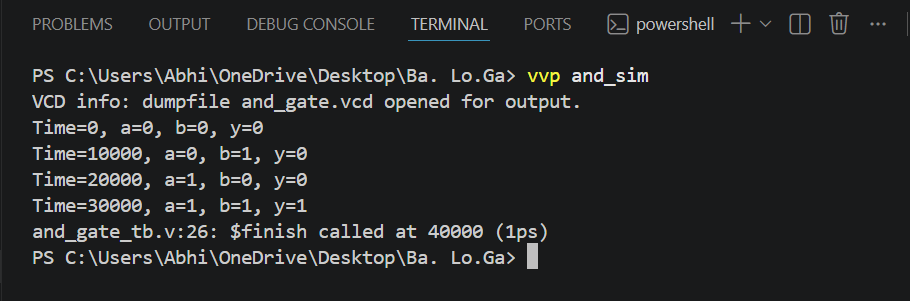

### OR Gate
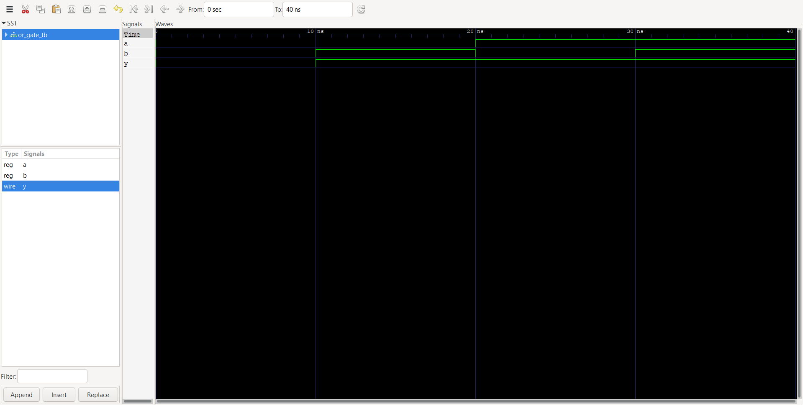
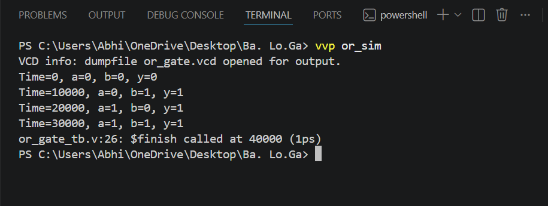

### NOT Gate
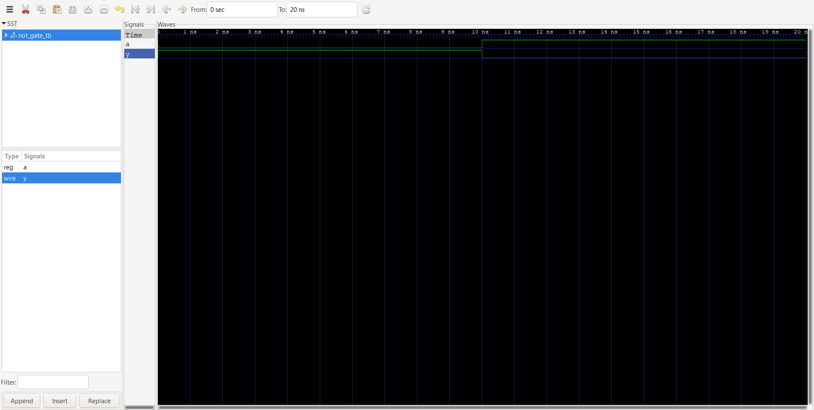
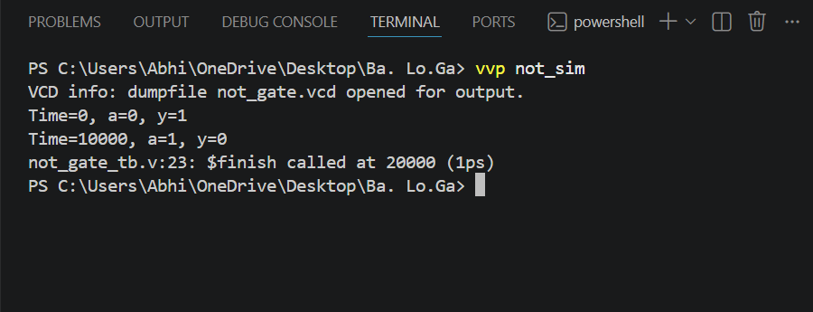

### NAND Gate

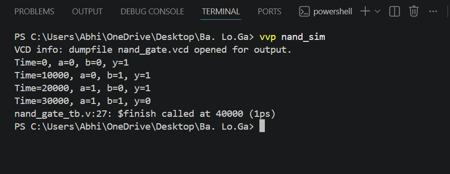

### NOR Gate
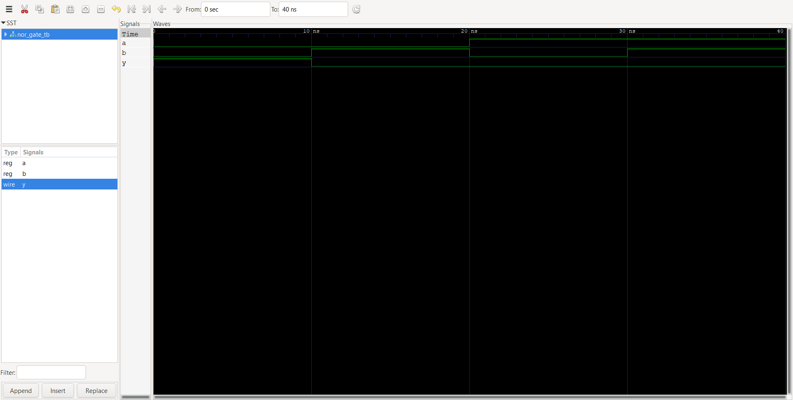
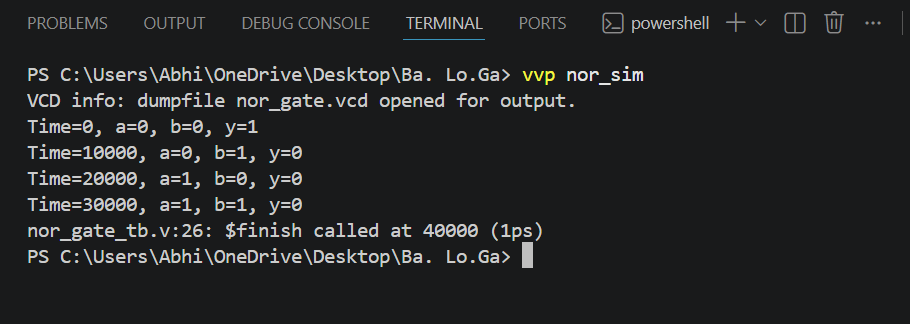

### XOR Gate

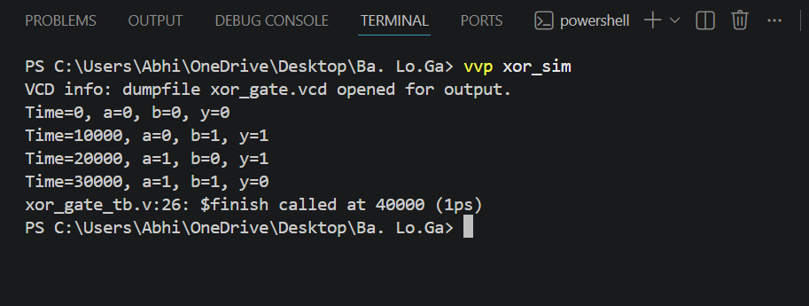

### XNOR Gate
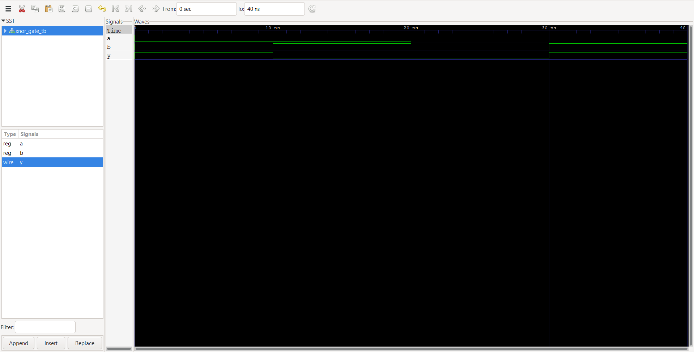
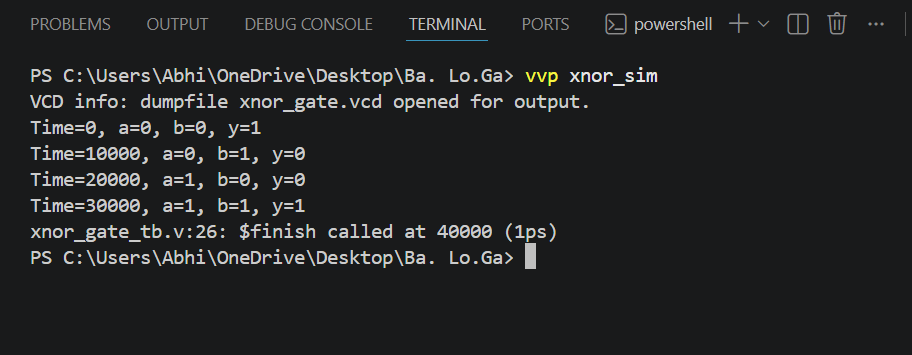

---

## Concepts Covered

### Verilog
- `module` and `endmodule` — defining a hardware block
- `input wire` and `output wire` — port declarations
- `assign` statement — continuous assignment for combinational logic
- Bitwise operators — `&`, `|`, `~`, `^`, `~&`, `~|`, `~^`
- Testbench structure — `timescale`, `reg`, `initial` block, `$display`, `$dumpfile`, `$dumpvars`, `$finish`
- Module instantiation — named port connection syntax `.port(signal)`

### Digital Design
- Behaviour of all 7 fundamental gates
- NAND and NOR as universal gates — any circuit can be built from only these
- XOR as the sum generator in binary addition — foundation of the ALU (coming in Repo 5)
- Difference between combinational logic (no memory) and sequential logic (covered in Repo 3)
- Continuous assignment — models real wires that are always active

---

## Tools Used

| Tool | Version | Purpose |
|------|---------|---------|
| Icarus Verilog | 0.9.7 / 1.1 | Compilation and simulation |
| GTKWave | 3.3.x | Waveform viewing and verification |
| VS Code | Latest | Code editor |
| Git | Latest | Version control |

---

## What's Next

This repository is **Step 1** in an 8-step roadmap building up to a complete 16-bit pipelined RISC processor.

| Step | Repository | Status |
|------|-----------|--------|
| 1 | `01-basic-logic-gates` | ✅ Complete |
| 2 | `02-combinational-circuits` | 🔄 In progress |
| 3 | `03-sequential-circuits` | ⏳ Upcoming |
| 4 | `04-finite-state-machines` | ⏳ Upcoming |
| 5 | `05-alu-16bit` | ⏳ Upcoming |
| 6 | `06-processor-components` | ⏳ Upcoming |
| 7 | `07-risc16-pipelined-processor` | ⏳ Upcoming |
| 8 | `08-protocols-and-interfaces` | ⏳ Upcoming |

> The XOR gate built here directly becomes the **sum bit generator** inside the full adder, which becomes part of the **16-bit ALU**, which becomes the **Execute (EX) stage** of the pipelined RISC processor.

---

## Author

**Abhi** — B.Tech ECE, 3rd Year
Building a complete VLSI design portfolio from logic gates to a pipelined processor.

[](https://github.com/abhichandra586)

---

*Part of an 8-repository VLSI learning roadmap — from AND gate to 16-bit pipelined RISC processor.*
